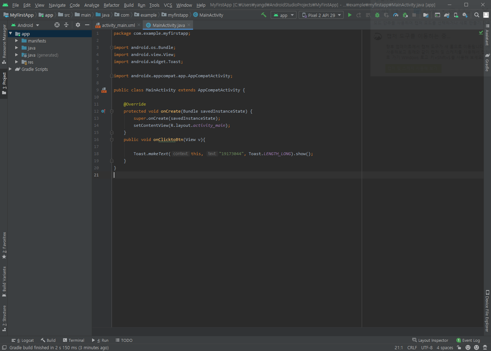
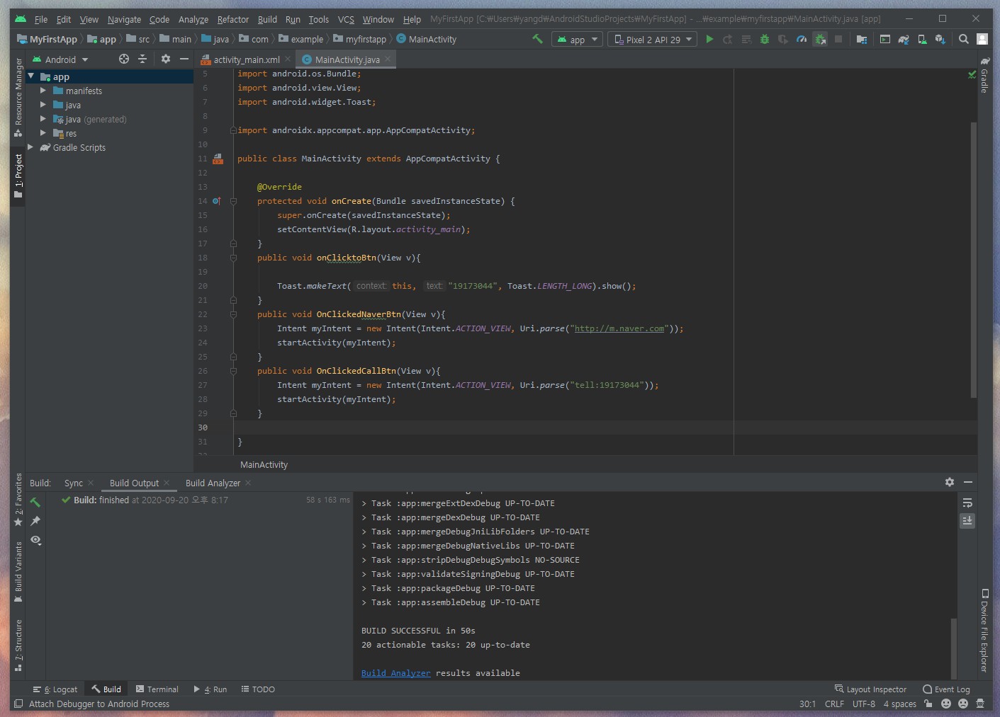
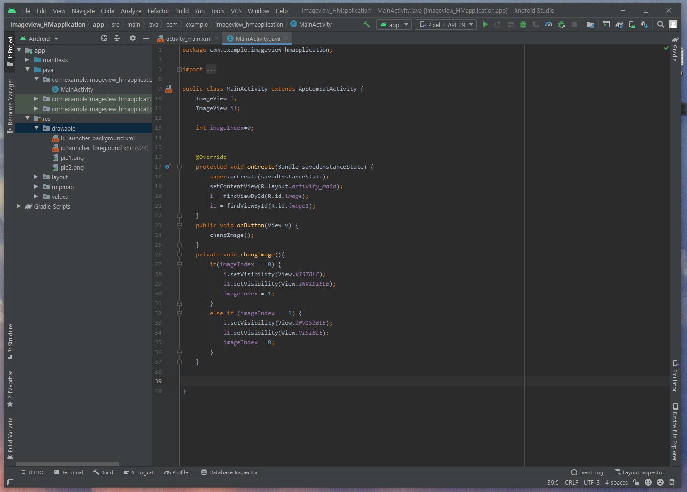
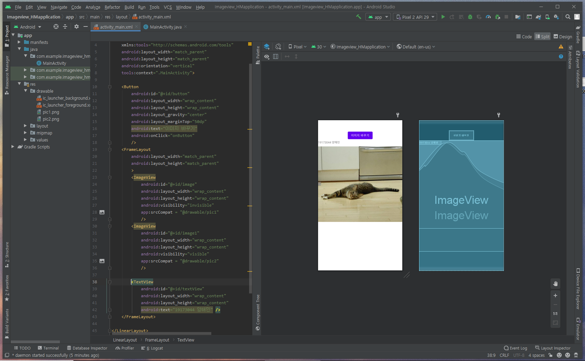

# 19173044 양해민

## 2주차 과제
 </img>

## 3주차 과제
 </img>

## 4주차 과제
  스크린샷 분류앱
  스마트폰을 사용하면서 여러가지 이유로 스크린샷을 저장하게 되는데 이를 정리하지 않고 방치하게 되면 필요한 것을 바로 찾기도 힘들고 불필요한 많은 용량을 차지하기도 한다.
  
  이러한 불편을 해소하기 위한 스크린샷 분류앱이다. 
  
  일시적으로 잠깐 사용하기 위한 스크린샷의 경우 일정 시간이 지나면 자동으로 삭제되고, 오래보관 해야하는 것등 개인의 수요에 맞는 분류 항목을 정할 수 있다.
  
  또 일정시간이나 날짜에 필요한 경우 특정 스크린샷에 알람을 설정하여 기억을 상기 시켜주는 역할을 해 줄 수 있다.  
  
## 7주차 과제
  </img>
  </img>
  
